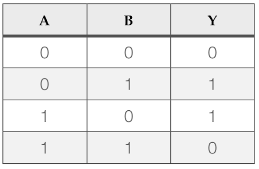
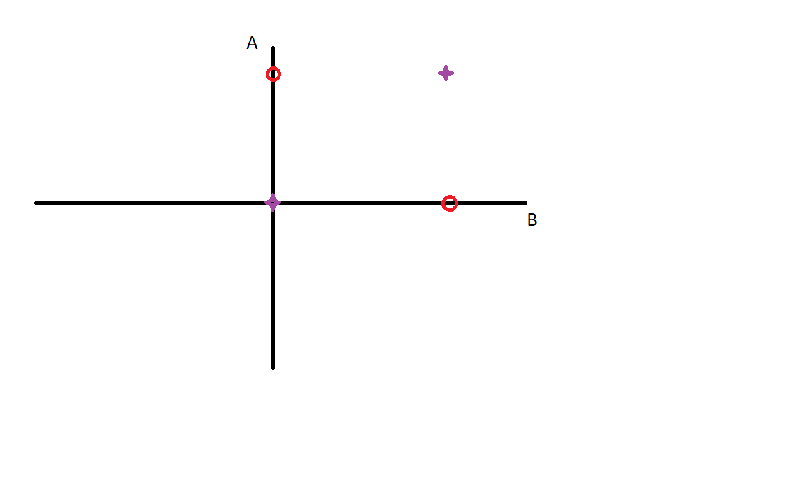

# MultiLayer-Perceptron-MLP-
Implementation of "Xor" function with MLP
# XOR gate:
XOR gate (sometimes EOR, or EXOR and pronounced as Exclusive OR) is a digital logic gate that gives a true (1 or HIGH) output when the number of true inputs is odd. It behaves according to the truth table provided below.



# MultiLayer Perceptron: 

A "single-layer" perceptron can't implement XOR. The reason is because the classes in XOR are not linearly separable. You cannot draw a straight line to separate the points (0,0),(1,1) from the points (0,1),(1,0).




# Code: 

You can run this code from your terminal/prompt/shell with typing
```python
MLP.py
```
